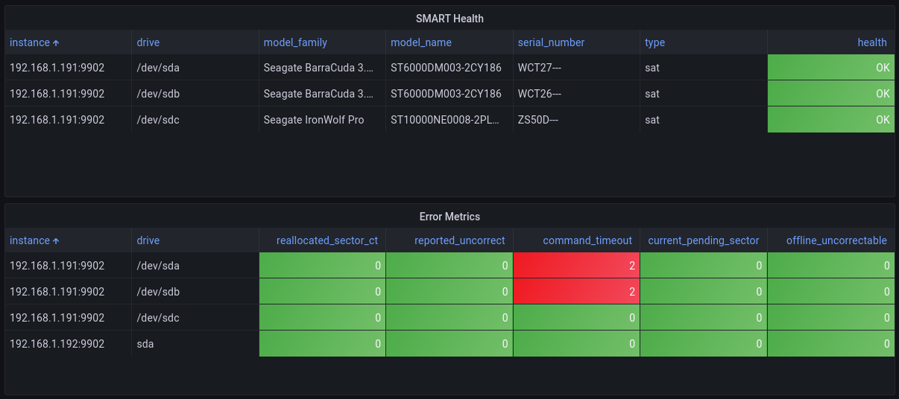
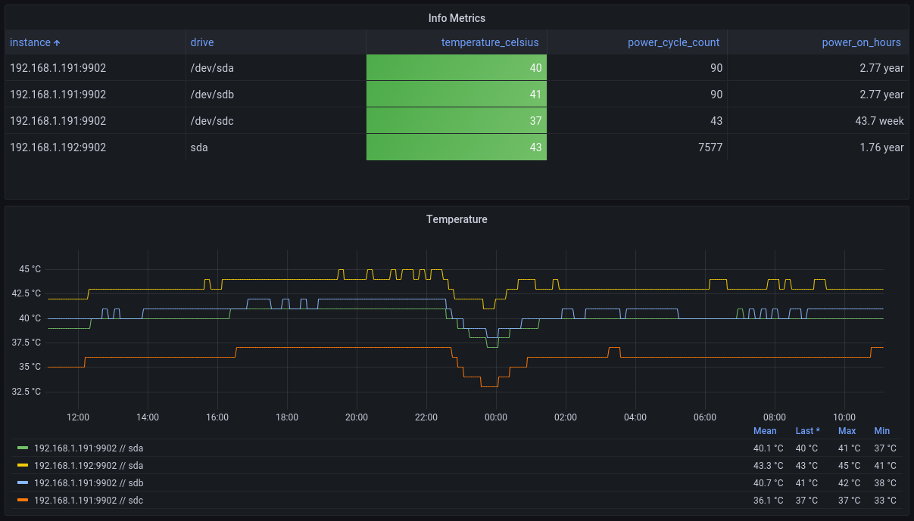

# Prometheus S.M.A.R.T ctl metrics exporter


This is a simple exporter for the [Prometheus metrics](https://prometheus.io/) using [smartctl](https://www.smartmontools.org/). The script `smartprom.py` also comes with `smartprom.service` so that you can run this script in the background on your Linux OS via `systemctl`. The script will use port `9902`, you can change it by changing it directly in the script. This script exports all of the data available from the smartctl.


## Install

_Note: You don't have to do this if you use the Docker image._

1. Copy the `smartprom.service` file into `/etc/systemd/system` folder.
2. Copy the `smartprom.py` file anywhere into your system.
3. Modify `ExecStart=` in the `smartprom.service` so that it points to `smartprom.py` in your system.
4. Run `chmod +x smartprom.py`
5. Install `prometheus_client` for the root user, example: `sudo -H python3 -m pip install prometheus_client`
6. Run `systemctl enable smartprom` and `systemctl start smartprom`
7. Your metrics will now be available at `http://localhost:9902`

## Docker usage

No extra configuration needed, should work out of the box. The `privileged: true` is required in order for `smartctl` to be able to access drives from the host.

Docker image is here: <https://hub.docker.com/r/matusnovak/prometheus-smartctl>

The architectures supported by this image are: linux/386, linux/amd64, linux/arm/v6, linux/arm/v7, linux/arm64/v8, linux/ppc64le, linux/s390x

Example docker-compose.yml:

```yml
version: '3'
services:
  smartctl-exporter:
    image: matusnovak/prometheus-smartctl:latest
    container_name: smartctl-exporter
    privileged: true
    ports:
      - "9902:9902"
    restart: unless-stopped
```

Your metrics will be available at <http://localhost:9902/metrics>

The exported metrics looks like these:

```shell
smartprom_smart_passed{drive="/dev/sda",model_family="Seagate BarraCuda 3.5 (SMR)",model_name="ST6000DM003-2CY296",serial_number="WCT362XM",type="sat"} 1.0
smartprom_exit_code{drive="/dev/sda",model_family="Seagate BarraCuda 3.5 (SMR)",model_name="ST6000DM003-2CY296",serial_number="WCT362XM",type="sat"} 0.0
smartprom_raw_read_error_rate{drive="/dev/sda",model_family="Seagate BarraCuda 3.5 (SMR)",model_name="ST6000DM003-2CY296",serial_number="WCT362XM",type="sat"} 83.0
smartprom_raw_read_error_rate_raw{drive="/dev/sda",model_family="Seagate BarraCuda 3.5 (SMR)",model_name="ST6000DM003-2CY296",serial_number="WCT362XM",type="sat"} 2.23179896e+08
smartprom_power_on_hours{drive="/dev/sda",model_family="Seagate BarraCuda 3.5 (SMR)",model_name="ST6000DM003-2CY296",serial_number="WCT362XM",type="sat"} 73.0
smartprom_power_on_hours_raw{drive="/dev/sda",model_family="Seagate BarraCuda 3.5 (SMR)",model_name="ST6000DM003-2CY296",serial_number="WCT362XM",type="sat"} 24299.0
smartprom_airflow_temperature_cel{drive="/dev/sda",model_family="Seagate BarraCuda 3.5 (SMR)",model_name="ST6000DM003-2CY296",serial_number="WCT362XM",type="sat"} 60.0
smartprom_airflow_temperature_cel_raw{drive="/dev/sda",model_family="Seagate BarraCuda 3.5 (SMR)",model_name="ST6000DM003-2CY296",serial_number="WCT362XM",type="sat"} 40.0
...
```

If you are using a MegaRAID card to connect the drives, the metrics will export look like these:

```shell
smartprom_power_on_hours_raw{drive="megaraid,0",model_family="Western Digital Ultrastar He10/12",model_name="WDC WD80EMAZ-00M9AA0",serial_number="XXXXXXXX",type="sat"} 28522.0
smartprom_power_on_time_hours{drive="megaraid,1",model_family="Unknown",model_name="HGST HUH728080AL5200",serial_number="XXXXXXXX",type="scsi"} 37341.0
```

## Configuration

All configuration is done with environment variables.

- `SMARTCTL_REFRESH_INTERVAL`: (Optional) The refresh interval of the metrics. A larger value reduces CPU usage. The default is `60` seconds.
- `SMARTCTL_EXPORTER_PORT`: (Optional) The address the exporter should listen on. The default is `9902`.
- `SMARTCTL_EXPORTER_ADDRESS`: (Optional) The address the exporter should listen on. The default is to listen on all addresses.

## Grafana dashboard

There is a reference Grafana dashboard in [grafana/grafana_dashboard.json](./grafana/grafana_dashboard.json).



